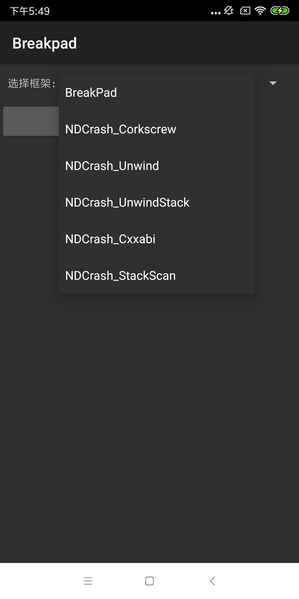

Chapter01-GEEKTIME
======
例子里集成了[Breakpad](https://github.com/google/breakpad) 来获取发生 native crash 时候的系统信息和线程堆栈信息。

注意：由于例子里提供的 minidump_stackwalker 可能由于环境不同，无法启动，建议同学自行编译来获取工具，具体教程可见https://github.com/google/breakpad


编译环境
=======
Android Studio 3.2
CMAKE
NDK(使用ndk 16-19版本)

项目构建
=======

例子采用 [CMAKE](https://developer.android.com/ndk/guides/cmake) 来构建 breakpad  库, 项目可直接导入 AndroidStudio 运行

例子支持`armeabi-v7a`,`arm64-v8a`,`x86` 三种平台。

1. 点击`crash`按钮应用会发生一个native崩溃

2. 生成的 crash信息，如果授予Sdcard权限会优先存放在`/sdcard/crashDump`下，便于我们做进一步的分析。反之会放到目录 `/data/data/com.dodola.breakpad/files/crashDump`




Dump 日志分析
========

1. 将抓取到的日志拉取到本地中
2. 使用例子中提供的 `tools/mac/minidump_stackwalker` 工具来根据 minidump 文件生成堆栈跟踪log
```
	 ./tools/mac/minidump_stackwalk crashDump/***.dmp >crashLog.txt 
```
	 
3. 打开文件后可以看到一个详细的 crash 日志，如下

```
Operating system: Android
                  0.0.0 Linux 4.4.78-perf-gdd4cbe9-00529-g1a92c1c #1 SMP PREEMPT Thu Nov 22 03:44:52 CST 2018 armv8l
CPU: arm
     ARMv1 Qualcomm part(0x51008010) features: half,thumb,fastmult,vfpv2,edsp,neon,vfpv3,tls,vfpv4,idiva,idivt
     8 CPUs

GPU: UNKNOWN

Crash reason:  SIGSEGV /SEGV_MAPERR
Crash address: 0x0
Process uptime: not available

Thread 0 (crashed)//crash 发生时候的线程
 0  libcrash-lib.so + 0x77e//发生 crash 的位置和寄存器信息
     r0 = 0x00000000    r1 = 0x00000001    r2 = 0xff80f2bc    r3 = 0xebe31230
     r4 = 0xec2850d4    r5 = 0x00000001    r6 = 0x00000000    r7 = 0xff80f2a8
     r8 = 0x00000056    r9 = 0xebe6f000   r10 = 0xff80f3a8   r12 = 0xcf1d8fd8
     fp = 0xff80f334    sp = 0xff80f294    lr = 0xcf1d579b    pc = 0xcf1d577e
    Found by: given as instruction pointer in context

    Stack contents:
     ff80f294 00 00 00 00 30 12 e3 eb bc f2 80 ff bc f2 80 ff  ....0...........
     ff80f2a4 30 12 e3 eb 98 f5 80 ff 65 40 32 cf              0.......e@2.    
    Possible instruction pointers:

 1  base.odex + 0x9063
     sp = 0xff80f2b0    pc = 0xcf324065
    Found by: stack scanning

    Stack contents:
     ff80f2b0 d4 50 28 ec                                      .P(.            
    Possible instruction pointers:

 2  dalvik-LinearAlloc (deleted) + 0xd2
     sp = 0xff80f2b4    pc = 0xec2850d4
    Found by: stack scanning

    Stack contents:
     ff80f2b4 74 05 81 ff 01 00 00 00 68 0c 84 13              t.......h...    
    Possible instruction pointers:

 3  dalvik-main space (region space) (deleted) + 0xc40c66
     sp = 0xff80f2c0    pc = 0x13840c68
    Found by: stack scanning

    Stack contents:
     ff80f2c0 07 00 00 00 00 00 00 00 00 00 00 00 00 00 00 00  ................
     ff80f2d0 00 00 00 00 00 00 00 00 00 00 00 00 00 00 00 00  ................
     ff80f2e0 00 00 00 00 00 00 00 00 00 00 00 00 00 00 00 00  ................
     ff80f2f0 00 00 00 00 00 00 00 00 00 00 00 00 00 00 00 00  ................
     ff80f300 00 00 00 00 01 00 00 00 00 00 00 00 98 f5 80 ff  ................
     ff80f310 56 00 00 00 a8 f3 80 ff 34 f3 80 ff e3 7f b5 eb  V.......4.......
    Possible instruction pointers:

 4  libart.so + 0x3e1fe1
     sp = 0xff80f320    pc = 0xebb57fe3
    Found by: stack scanning

    Stack contents:
     ff80f320 00 00 00 00 68 0c 84 13                          ....h...        
    Possible instruction pointers:
```

4. 符号解析，可以使用 ndk 中提供的`addr2line`来根据地址进行一个符号反解的过程,该工具在 
`$NDK_HOME/toolchains/arm-linux-androideabi-4.9/prebuilt/darwin-x86_64/bin/arm-linux-androideabi-addr2line`
 
 注意：此处要注意一下平台，如果是 arm64位的 so，解析是需要使用 `aarch64-linux-android-4.9`下的工具链
```
arm-linux-androideabi-addr2line -f -C -e sample/build/intermediates/transforms/mergeJniLibs/debug/0/lib/armeabi-v7a/libcrash-lib.so 0x77e                           
//输出结果如下
Crash()

```
补充内容
=======

关于在 x86模拟器下无法生成 crash 日志问题的解决方法

在 x86 模拟器下无法生成日志的解决方法如下：
1. 将 ndk 切换到 16b，下载地址： https://developer.android.com/ndk/downloads/older_releases?hl=zh-cn 
mac 版：https://dl.google.com/android/repository/android-ndk-r16b-darwin-x86_64.zip
2. 在 Androidstudio 里设置 ndk 路径为ndk-16b的路径
3. 在 sample 和 breakpad-build 的 build.gradle 配置里增加如下配置
```
 externalNativeBuild {
            cmake {
                cppFlags "-std=c++11"
                arguments "-DANDROID_TOOLCHAIN=gcc"
            }
        }

```


相关内容
=======
https://github.com/google/breakpad
例子里只提供了 Mac 的工具，如果需要其他平台的工具，可以去编译源码获得，可以参照 breakpad 项目的说明文档来编译获取。
